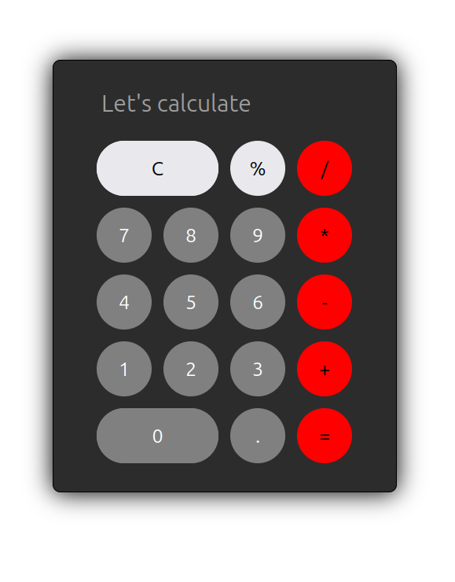

  # Calculator 

  
  ## 🧮 Simple Calculator
  
  ### A basic web-based calculator built with HTML, CSS, and JavaScript. Supports mouse clicks and keyboard input for standard arithmetic operations like addition, subtraction, multiplication, division, and percentages. Clean interface and real-time evaluation.
  
  
